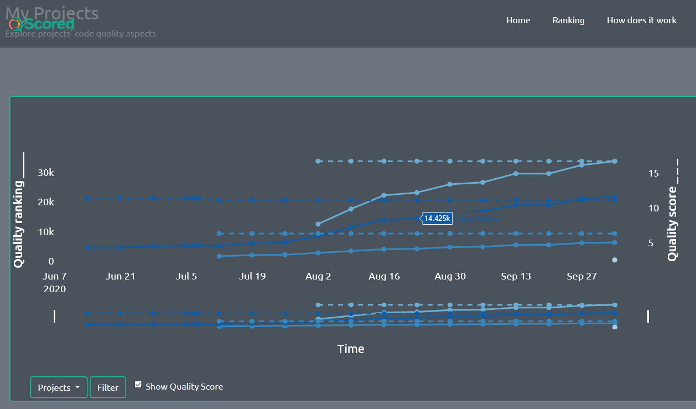
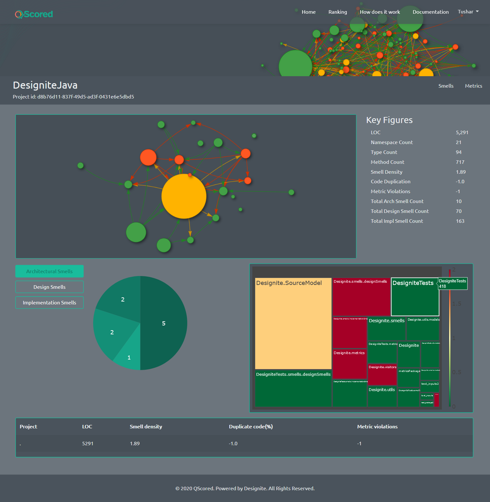

# DesigniteJava action for GitHub

## What it does?
This action enables **continuous code quality monitoring** for your Java project. It analyzes your Java code using [DesigniteJava](https://www.designite-tools.com/designitejava/), detects a comprehensive set of architecture, design, and implementation smells, computes a large set of object-oriented code quality metrics, and uploads the results to QScored automatically to keep track of your project's code quality over time.

## How to configure it?
It is a one-time process.

### Step 1. Obtain Personal access token and add it to GitHub secrets
- Create a new personal access token for your GitHub repository. You may do it by going to “Settings” -> “Developer settings” page of your GitHub account. Select “Personal access token” tab and create a new token.
- Add this token to your repository’s secrets. Go to “Settings” within your repository page and select “Secrets”. Add a new secret by pasting the access token in the Value field and giving a meaning name (e.g. PAT).

### Step 2: Add QScored API key to secrets
[QScored](https://www.qscored.com) allows you to visualize code quality information.
- If you do not have a QScored API key for your account, follow these steps to get one.
    - Login to your QScored account. If you don’t have an account yet, create one.
    - Go to the “Settings” page after logging in; it is located on the right top side of the navigation bar. Click on “Request an API key” option; you will get your API key within seconds in your inbox.
- Add the API key to your GitHub’s repository secrets. Let’s say you name it QSCORED_API_KEY.

### Step 3: Optional: Add your Designite key to secrets

If you have Designite’s professional (or academic) license key, add the key to your GitHub’s repository secrets. Let us call it D_KEY

### Step 4: Add a GitHub Actions workflow file

This is the last and very crucial step. Create a folder `.github` on your root directory of the project and create `workflows` folder inside the `.github` folder. Create a workflow file (say `actions.yml`) in the newly created `workflows` folder. The contents of the `action.yml` file depend upon your project language and tasks.

A sample action file is provided below.

```yaml
name: CI

on:
  push:
    branches: [ main ]
  pull_request:
    branches: [ main ]

jobs:
  build:
    runs-on: ubuntu-latest
    steps:
    - name: DesigniteJava_action
      uses: DesigniteTools/DJAction@v1.0.0
      with:
          PAT: ${{ secrets.PAT }}
          QSCORED_API_KEY: ${{ secrets.QSCORED_API_KEY }}
          EMAIL: 'your-email@gmail.com'
          PRJ_NAME: 'your-project-name'
          OPEN_SOURCE: False
```

Change the parameter values (EMAIL, PRJ_NAME, and OPEN_SOURCE). EMAIL should be the same email that you used to create QScored account. PRJ_NAME is your QScored project name for this project. The value of OPEN_SOURCE could be set to True/False depending upon whether you would like to make the code quality results of the project public or not.


## What you will get?
Once configured, your Java project will be analyzed on each commit (can be configured differently), and the analysis report will be placed in your QScored account. You can visualize the trend of code quality within QScored.



Also, you may take a deeper look at your project's code quality at a specific commit using QScored's engaging visualizations. The visualizations are designed to help you understand the quality hotspots of your projects and help you dig deeper into them.

